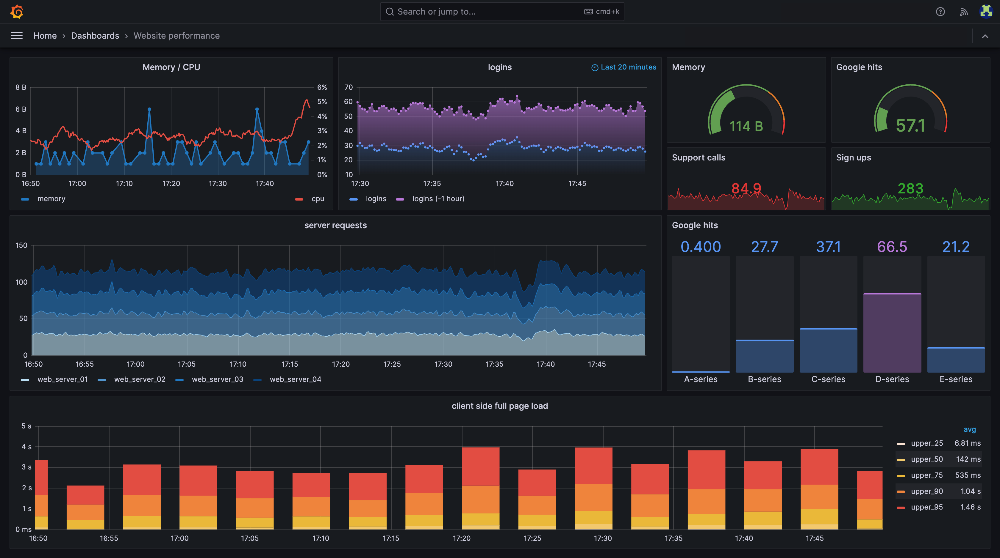
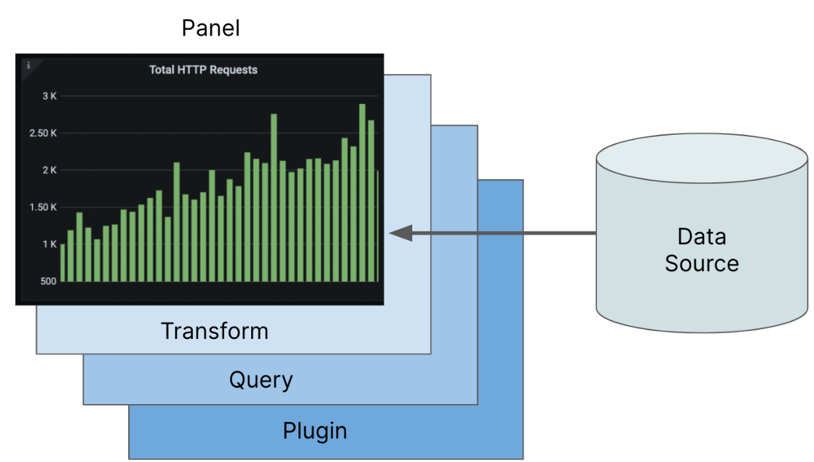
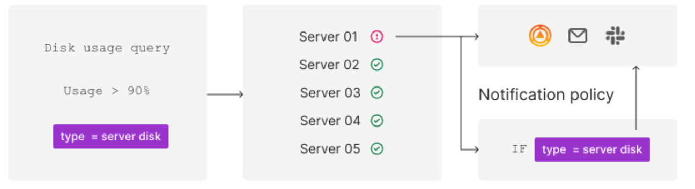
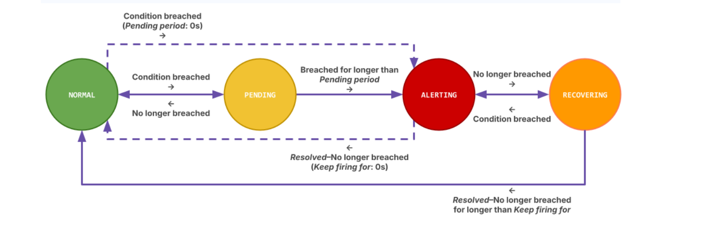

# Grafana

Grafana open source software enables you to query, visualize, alert on, and explore your metrics, logs, and traces wherever they are stored. Grafana OSS provides you with tools to turn your time-series database (TSDB) data into insightful graphs and visualizations

### 1. Grafana Core Concepts

- **Dashboards**
  A collection of visualizations. Each dashboard is basically your entire monitoring page.
  
- **Panels**
  Individual visual blocks inside the dashboard (graph, table, stat, etc.). Each panel makes a query and shows results.
- **Rows**
  Used to group panels. Helpful for organizing big dashboards.
- **Data Sources**
  Backends from where Grafana fetches data:

  - **Prometheus** for metrics
  - **Loki** for logs
  - **Tempo** for traces
  - Others like Elasticsearch, MySQL, CloudWatch, etc.

- **Organizations & Users**
  Access control. You can have multiple teams, permissions, and roles inside Grafana.

### 2. Panel Plugins

- **What is a panel plugin?**
  A custom visualization component. Basically, the UI block that shows data on a dashboard.
- **Types of panels**

  - Graph
  - Table
  - Gauge
  - Bar chart
  - Heatmap, etc.

- **How panel plugins work**

  - Panel makes a query to a data source
  - Grafana receives data as data frames
  - Plugin renders the data visually using React

- **Creating a custom panel plugin**

  - we use the Grafana Plugin SDK
  - Write React components
  - Handle query results, config options, custom UI
  - Build , sign , load it into Grafana

### 3. Data Sources

- **How Grafana connects to backends**
  Every data source has an integration layer. we configure URL, auth, and query methods.
- **Query Editors**
  Each data source provides its own query editor UI (PromQL for Prometheus, LogQL for Loki, SQL for MySQL, etc.).
- **Data Frames**
  Grafana internally converts all results into a **unified structure** called data frames.
  Makes all panels work with any data source.

### 4. Transformations

- **What is the transformation pipeline?**
  These are operations applied after data is fetched, inside Grafana.
  Helps we clean or modify data without changing backend queries.
- **Common transformations**

  - Filter fields
  - Rename fields
  - Join multiple queries
  - Add/Calculate new fields
  - Group by
  - Organize fields

- **When to use transformations vs backend queries?**

  - Use backend queries when the logic is heavy or data is huge.
  - Use transformations when you want fast UI-side adjustments.

### 5. Variables & Templating

- **Dashboard Variables**
  Allow dynamic filtering (like dropdowns).
- **Types of variables**

  - **Query variable** → fetches values from a data source
  - **Custom variable** → manually defined list
  - **Constant variable** → fixed value

- **Using variables in panel queries**
  You can use them like `$region`, `$server`, etc.
- **Dynamic dashboards**
  Makes dashboards interactive. Automatically updates panels when a variable changes.

### 6. Alerting UI

- **Alert Rules**
  Conditions evaluated on metrics/log data.
  Example: CPU usage > 80% for 5 mins.
- **Evaluation Engine**
  Grafana checks the rule at intervals, decides OK/Firing/NoData.
- **Notification Channels**
  Slack, PagerDuty, Email, Webhooks, etc.
- **Alert Dashboard**
  Central place to view alert rules, history, and statuses.

## 

### 7. App Plugins

- **What is an App Plugin?**
  A full mini-application inside Grafana.
  It is more than a panel — can include pages, routes, navigation, custom UIs.
- **Difference: Panel Plugin vs App Plugin**

  - Panel plugin: only a visualization
  - App plugin: full workflow, multi-page, custom UI, own navigation

- **Use Cases**

  - Observability apps (Logs Explorer, Metrics Explorer)
  - Integrations with external tools
  - Company-specific monitoring apps
  - Multi-step flows or dashboards with custom logic

## Part 2: Scenes Framework Deep Dive

### What is Scenes?

- Scenes is a new framework in Grafana used for building app plugins, custom dashboards, and full UI experiences.
- Completely React-based and uses a composable architecture where everything is a “scene object.”
- Main goal: give developers more control, better structure, and support for complex apps (not just simple panels).
- It was created because the old dashboard model had limitations:

  - Hard to build multi-page apps
  - Re-rendering logic was messy
  - State management was not clean
  - Plugin developers had to write too much boilerplate
  - No good way for dashboards + apps to share state/time/variables cleanly

## Core Concepts of Scenes

### 1. SceneObject

- The base building block of everything in Scenes.
- Every UI element, layout item, query handler is a SceneObject.
- It has:

  - **State** (immutable, updated through state changes)
  - **Children** ( objects inside objects)

- Think of it like a “reactive model” where UI updates automatically when state changes.

### 2. SceneLayout

- Controls how scenes are arranged on the screen.
- Supports different layout types:

  - Rows
  - Columns
  - Grids

- layouts inside layouts.
- Very flexible compared to old dashboard rows/panels.

### 3. SceneQueryRunner

- Handles data fetching inside Scenes.
- It automatically runs the query and provides data as a data frame.
- Helps link UI components directly with query results.

---

### 4. SceneTimePicker

- Manages time range selections inside a scene.
- Example: Last 1 hour, Last 24 hours, Custom range.
- Supports syncing:

  - Multiple panels
  - Multiple child scenes

- Helps create dashboards where time selection updates everything together.

### 5. SceneVariableSet

- Handles variables inside Scenes.
- Similar to dashboard variables but more powerful.
- Used for:

  - Dynamic filters
  - Cascading dropdowns
  - Passing variable values to queries

- Fully reactive: changing a variable updates all dependent scenes.

### 6. SceneReactObject

- Used to render custom React components inside a scene.

  - Built-in scene objects
  - custom UI

- Useful when you want something that's not part of standard components.

## State Management in Scenes

### Scene State vs React State

- **Scene state** is part of the Scenes framework. It's immutable, follows a structured pattern, and updates trigger UI re-renders automatically.
- **React state** is normal component-level state (`useState`, `useEffect`) but in Scenes you usually avoid too much of it.
- Key idea: Scene state = data model, React state = UI-only things.
- Scene state is shared across scene objects, while React state is isolated to components.

### Immutable Updates

- Scenes updates always go through immutable state changes, similar to Redux.
- Instead of mutating values, you create a new state object.
- This guarantees predictable re-renders and avoids stale references.

### State Change Triggers Re-render

- Every time you update scene state:

  - The framework recalculates the UI
  - Only the affected parts re-render

- Helps maintain consistent UI structure.

### Accessing Parent / Child State

- Because everything is a hierarchy, a child object can:

  - Read from the parent’s state
  - React when parent state changes

- Parent scenes can also access child states to coordinate behavior.

---

## Scene Hierarchy

### Parent–Child Relationships

- Scenes are built like a tree structure: parent → children → grandchildren.
- Every UI part is a SceneObject inside another SceneObject.

### Composing Complex UIs

- You can start with very basic scenes and combine them:

  - Layouts
  - Query runners
  - Variables
  - Custom components

- This is the main strength of Scenes compared to old dashboards.

### Communication Between Scenes

- Because all objects are connected through a hierarchy:

  - A parent can update child state
  - A child can notify parent via callbacks

- No messy props drilling like in plain React.

## URL State Management

### Syncing Scene State with URL

- Scenes can automatically sync certain states (time range, variables, view mode) directly into the URL.
- This helps in preserving state when reloading or sharing links.

### Deep Linking

- You can link to:

  - Specific scenes
  - Specific tabs
  - A particular filter
  - A particular time range

- This was difficult in traditional dashboards but easy with Scenes.

### Browser Navigation

- Because state is synced to URL:

  - Back/forward buttons work correctly
  - State is restored when revisiting

## Comparison with Traditional Panels

### Traditional Panels

- A panel is just a visualization component inside a dashboard.
- Each panel is isolated:

  - Own query
  - Own UI
  - Very limited communication with other panels

- Hard to build multi-step flows or custom logic.

### Scenes

- Full control over:

  - Layout
  - State
  - Variables
  - Multiple queries
  - Navigation

- Lets you build entire applications, not just panels.

### When to Use Scenes vs Panels

Use Panels when:

- we only need a standalone visualization
- No cross-panel interaction
- Simple UI inside a dashboard is enough

Use Scenes when:

- we are building something more complex
- You need:

  - multiple pages
  - custom layouts
  - shared state
  - deep linking
  - interactive UI

- Basically when the plugin looks more like a small app than a panel.

## React Integration

### How Scenes Works With React

- Scenes is fully built on React, but it does not rely only on React components.
- Scenes controls state + hierarchy, and React just renders whatever the scene tree produces.
- You usually write React components inside SceneReactObject.

### Scene Rendering Lifecycle

1. Scene objects are created (with initial state).
2. Scenes engine builds a reactive tree.
3. On state change, the engine recalculates the affected nodes.
4. React components re-render based on updated scene state.
5. UI updates automatically.

### Using React Hooks Inside Scenes

- You can use normal React hooks (useState, useEffect, useMemo).
- But hooks should not hold main data.
- Core logic lives in scene state, not React state.
- Hooks are mainly for:

  - UI interactions
  - Local visual toggles
  - Running effects tied to scene state changes

## Data Flow in Scenes

### Handling Loading and Error States

- SceneQueryRunner exposes:

  - loading
  - error
  - data

- we show loading spinners or error messages in your React component based on these flags.
- No need to manually manage request states; runner handles it.

### Data Transformation Within Scenes

- we can apply lightweight transformatio- SceneQueryRunner exposes:

  - loading
  - error
  - datans:

  - Filtering
  - Combining results
  - Mapping to UI-friendly structure

- Heavy transformations should still happen in backend or datasource queries.

## Event Handling & Interactivity

### User Interactions

- Users can click on charts, change filters, select time ranges.
- React components capture user events normally.

### Updating Scene State

- When something happens (button click, dropdown change):

  - You call `scene.updateState({ ... })`
  - Scene re-renders automatically
  - All dependent scenes update

### Communication Between Scenes

- Scenes use the hierarchy for interaction:

  - Child can send events to parent
  - Parent updates state
  - Another child re-renders based on updated state

## Performance Considerations

### Efficient Re-renders

- Scenes is designed to re-render only what changed.
- Immutable state updates help isolate changes.

### Memoization

- Use `useMemo` and `useCallback` inside React components to avoid unnecessary re-renders.
- Good when UI is heavy or data is large.

### Lazy Loading of Data

- Scenes supports lazy initialization:

  - Children scenes only load queries when visible
  - Helps big multi-page apps perform faster

### Handling Large Datasets

- Avoid heavy transformations in React
- Use efficient components for charts/tables
- Limit series count, pagination if needed
- Pre-process data on backend where possible
- Use streaming APIs if supported by data source

### Structure of a Scenes-based Plugin

A typical Scenes plugin has:

1. **Entry Point**

   - Usually the `plugin.ts` or `module.ts` file.
   - Defines the plugin type (app plugin).
   - Registers the root React component or scene.

2. **Scene Definition**

   - A function that returns the root SceneObject tree.
   - For example:

     - A root layout
     - Time picker
     - Variable set
     - Query runners
     - Child views

   - This is the main logic of the plugin.

3. **Rendering**

   - Usually a React component that mounts the scene:

     - Uses `<SceneComponent />` or similar helper.

   - This is where the Scenes lifecycle starts.

### Layout Patterns

1. **Grid layout** for dashboards
2. **Tabs** for multi-page experiences
3. **Nested scenes** where each tab has its own children
4. **Sidebars + main area** layouts (common in apps)

### Query Patterns

- Multiple queries in a single view
- Queries depending on variable changes
- Queries depending on each other
- Updating query runners when time range changes
- Lazy loading: only fire queries when view is active

### State Management Patterns

1. **Global State**

   - Stored in the root scene
   - Shared by multiple child scenes
   - Examples: selected service, time range, active tab

2. **Local State**

   - Stored in individual scenes
   - Used for component-level toggles, local filters

3. **Derived State**

   - Based on query results and transformations
   - Not stored directly; recalculated when needed
