# Observability Systems - Complete Picture

Build comprehensive understanding of observability systems, architecture, and UX patterns.

## 1. Observability Fundamentals

#### what is observability?

Observability is the capablity of system to allow enginers to understand its internal state based on the data its produced

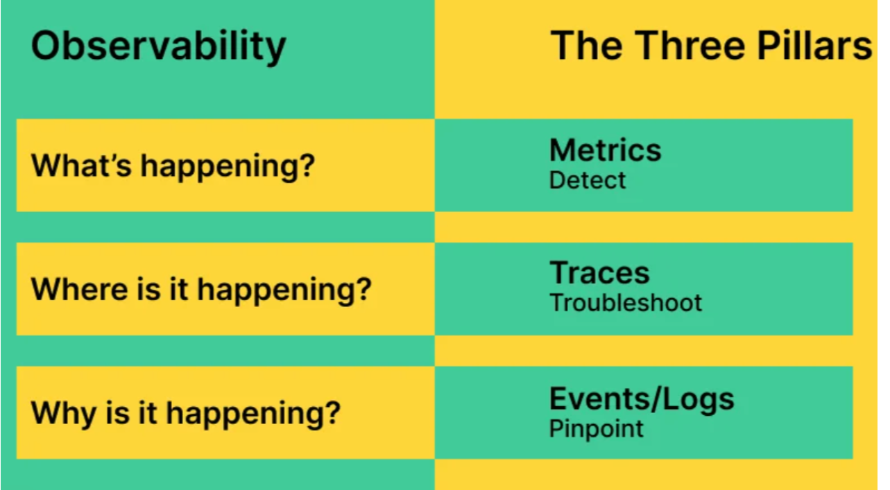

The pillars of observability is Metrics, Logs, Traces

### Metrics

Metrics are numerical measurements recorded over a time that help us to understand how a system performing

#### Metrics Data contains:

- name : name of the process `process_count`
- value: number of times its counted like `20` request happen
- timestamp: at what time its computed
- labels: its represents in key value pair line `method="GET"`

`api_requests_total{status="200", method="GET"} TIMESTAMP VALUE`

They are best when we want to measure and react fast

- Observing the system performance that can be CPU,Memory usage,
- For setting the alerts (when its exceed the threshold limit)

It helps us to answer the following questions

- Do we need to scale up when its meet the threshold
- Is CPU is working high on the server
- Is the number of failed request increased
- Is API getting slower

#### Types of Metric Format

1. **counter**
1. **Guage**
1. **Histogram**
1. **Summary**

**1. Counter** : As name suggest its used for counting. It only increase and never go down and resets when the system resets (Odometer in bike)

- **Eg:** how many time api request is recived, how many are requested are failed

**2. Guage:** Its like a speedometer in bike that fluctuate. Its value go's up and down

- **Eg:** CPU consumpstion, memory usage by a process

**3. Histogram:** Its like a bar Table in real world analogy where each bar(range like 10-20,20-30) width is repsented as a bucket and the bar height represent the number of occurances happend in that range and it also contains total count and accumulated sum

- **Eg:**: success request in 100ms , 200ms, 100-200ms, as while as failure requests

**Summary:** Its similar to histogram without a bucket, Instead of showing counts for each range, it directly tells you how long it took for a certain percentage of requests to complete.

- **Eg:** p95 means - 95% of requests completed within Y milliseconds.

---

### Logs

Log are texts records generated by the applictioin that describe what happend at a specific moment

#### Log Data contains:

- TimeStamp: When the event happens
- Log Level: What is the type of error like DEBUG, WARN, INFO, ERROR
- Message: Description of what happend like "user login successful"
- Metadata : Its optional, it contains the userID, proceesID, IP address

#### When to use logs?

- When end user facing an issue in appliction
- when we want to know what happend before system crash
- when we want to trace the user actions
- When system throw an error

**_log_** example:
`INFO 2025-10-10T10:21:00Z User login successful {"userId": 57, "ip": "192.168.1.2"}`

#### Types of Log Format

1. **Unstructured Logs**
2. **Structured Logs**

**1. Unstructured Logs** : they are written in plain text which is human readble but hard for machines to figure out.

- **Eg:** `WARN 2025-10-10T10:21:00Z User login suspect {"userId": 57, "ip": "192.168.1.2"}`

**2. Structured Logs** : they are written in JSON format mostly which is human readble and machines also easily understand.

```
{
  "timestamp": "2025-11-19T10:21:00Z",
  "level": "INFO",
  "message": "User login successful",
  "userId": 57,
  "ip": "192.168.1.2",
  "service": "auth-service"
}
```

### Traces

Traces shows the journey of the single request that flows through diffrent services in the system

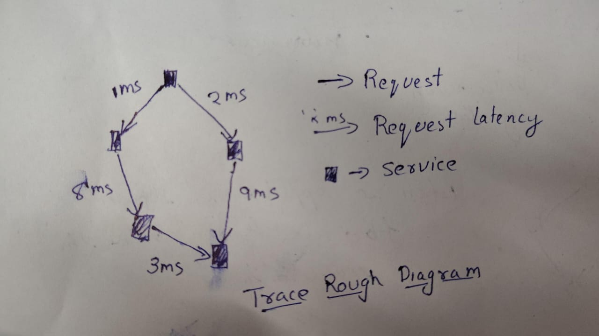

#### Trace Data contains:

1. **Operation name**: Name of the operation like payment.verify
1. **start and end timestamp:**: start and end timestamp of the operation
1. **Duration:**: Duration for setteling the operation
1. **Span ID and Trace ID:**: span ID is unique for each step while Trace Id is same for all the steps
1. **Attributes:** it contains the DB query, userID, ..etc

#### When to use Trace?

- When our request is passing threw multiple services
- when we want to trace how much lateny a service is taking
- when we want to debug and find where the issue is happening

#### Concepts in Tracing

1. Spans
1. Trace Context
1. Baggage

**1. Spans:**
A span is a single step in a request Journey. each service creates a new span

**2. Trace Context:**
its a metadata that is needed to continue a trace across services. it has traceID, spanID, sampled

**3. Baggage:** It holds custom data that travels a across services during a trace

### Common protocols:

OTLP, Prometheus exposition format, StatsD, Syslog, Jaeger Thrift

1. **OTLP(OpenTelemetry Protocol)**: Its a modren protocal for sending the metrics, logs, traces. its Highly effcient and its standard

1. **Prometheus Exposition Format**: Its a text based format used for exporting metrics.

1. **Syslog**: Its used for transmitting logs

### Cardinality:

its the number of unique combinations of metric labels like (userId,orderID)

`api_requests_total{status="200", method="GET"}
`
this has 2 labels , 1 time series therfore low cardinality but if we add some more labels and there are millions users then then million timeseries then its high cardinality

Using ID(userid,orderId), timestamps,urls with params, ip address cause the Cardinality Explosion

High cardinality increases the memory usage, CPU usage, System crashes in Prometheus

### Time-Series Nature of Observability Data

Time-series everywhere in onservablity. Data is recorded as pairs (timestamp, value)

its helps to find out the spikes, patterns, latency, changes

**metrics:** `http_requests_total{status="200"} (count timestamp )`

**Logs:** each logs has a timesstamp
`logLevel TimeStamp message`

**Traces:** each span has a start and end timesstamp
`Span: payment.verify
Start: 10:22:00
End:   10:22:180`

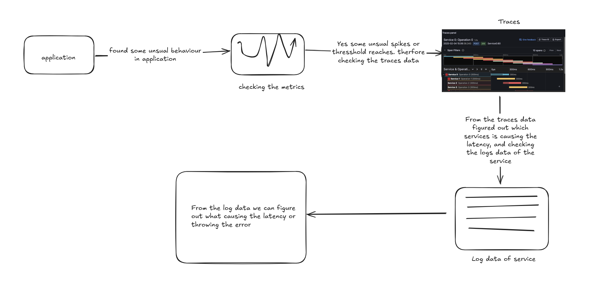

## 2. Data Collection Architecture

### What is a collector

A collector is an Agent that collect telementory data which is Log,metrics,traces before sending it to the backend observablity

#### Why do we need it instead of directly sending to backend

While the observablity server is running down and if we are trying sending data directly to the observablity its will take time to respond so its going to effect our main application but if we use collector agent the appliction will send its telementory data to local agent and the local agent works asyncronously to send data to backend and also performs protocal transform to standard **OTLP** amd do
retries.

### Collection models

1. Agent-based collection

   - we install an agent process on VM, server.
   - the agent works locally and handles all telementory related work
   - its work even backend is unreachable
   - performs batching so its decrease load on the backend
   - it can process, filter telememtory before sending

   1. its uses more CPU and Memory
   2. its requires installation and updation for newer version

2. Agentless Collection

   - No local agent running on the server
   - no installation needed
   - its good for serverless (
     cloud providers
     )
   - cloud providers collecting AWS Lambda logs via CloudWatch

   1. harder for debuging
   2. more latency as it need to pass threw multiple cloud services

3. eBPF-Based Collection

   - is a Linux kernel technology that allows running programs inside the kernel without modifying kernel code

   - its doesnt require instrumentation

   - its works with any language

   - it can observe function calss, network calls, system calls, events.

   - low overhead as its runs direcly in kernel

   1. its require Linux kernel ≥ 5.X
   2. harder to debug
   3. Not available in windows

### Instrumentation

Instrumentation means adding logic(code) to your application to collect telemetry data

#### Manual Instrumentation

Addind logic manually to collect the telemetry data

- it gives us full control
- We can able to collect whichever the data we needed
- Unique logs that no library can auto-generate
- we can write our custom logic

1. its need time and work force
2. Sometimes oversight can be happen

#### Auto-Instrumentation

Instrumentation added automatically by a library/agent without modifying your application code

- it overide HTTP request
- Its wrap around DB Query
- it can listen incoming
  and outgoing HTTP trace
- It need less workforce

1. Custom logic is missing
2. it cn increase the overhead by adding the data that we dont require

#### Push Vs Pull Models

1. **Push Model**

   - A serivce push telemetry data to a collector or backend at regular intervals

   ```
   App -> (push at regualar interval) -> collector/Backend
   ```

   - when the data need to send to different applications
   - when its need to perform retries and buffering, if the backend is down.
     -frontend and serverless

2. **Pull Model**

   - the backend scrapes the source endpoint to retrive telemetry

   - when we want to avoid agent installation
   - easy to know whether the service is down or not

### processing happens at collection point

#### Filtering Unwanted Data

Remove telemetry that is noisy, too expensive and not needed

its svaes storagecost, reduce network bandwidth, reduces noise so alerts are meaninfful

#### Sampling Strategies

Sampling means reducing the volume of data by following one of the Strategies.

1. **Head-based Sampling :**
   Decision made at the beginning of the request. Its good for low latency.low overhead but may miss errors requests
   eg: Sampling 1% of incoming requests

2. **Tail-Based Sampling :**
   Decision made after the trace is complete.
   collector waits and send the intresting traces

3. **Probabilistic Sampling :**
   Use probability logic (e.g., 10%) for consistent sampling. its good for large data

#### Buffering and Batching

**Buffering** is storing the telemetry data temporarily like sending data after collecting 100 log lines

**Batching** is sending the data at regular interval of time like sending the logs collected for every 10 sec

#### Metadata Enrichment(Tags, Labels, Context)

collector adds additional data automatically like userId, env, region, serviceName so that it makes telemetry searchable, filterable

#### Protocol Translation

Different tools use different protocols. Collector can convert one protocol to another standardize format like `StatsD → OTLP`

### Collection at different layers:

#### Application layer (instrumented code)

Using liberary and manual instrumentation at the code base level to emit the telementory data, like custom matrics , traces, application logs

#### System layer (host metrics, system logs)

Using Node exported,Windows performance counters to emit the system logs like CPU, Memory usage, Disk IO, System logs

#### Network layer (packet capture)

Using Service mesh telemetry, Sidecars, Sidecars to emit the betwork logs like paket loss, request latency, connection error.

#### Kernel layer (eBPF)

Using eBPF programs to collect kernel level termentory data like process-level telemetry,
network events, detailed performance data

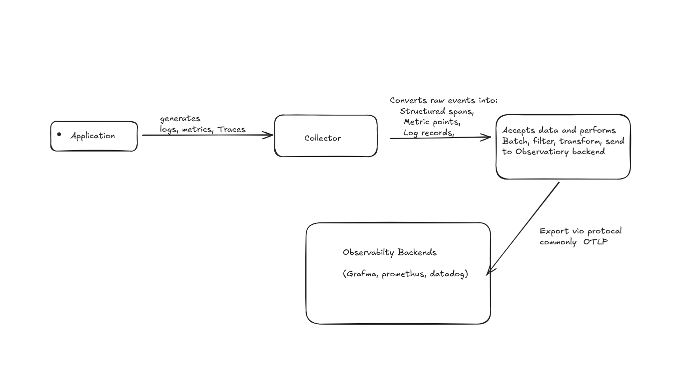

---

## 3. Backend Pipeline Architecture

### Ingestion Layer

It collect data from all sources and
do distribution, handling, intial validation and routing.

**How Does Data Arrive** Data arrives through transport protocols

- **HTTP** - Its mnost common for web/mobile apps, IoT gateways.
- **gRPC** - Used for service-to-service inside the microservice systems. Its binary and we never see
- **TCP** - Transmission Control Protocol, which is used for the real-time chat, IoT devices

All this data is collected and forword to
streaming systems like Kafka

#### Load Balncing

Igestion has to handle the millions of requests, so we use Load Balncer which disrtibutes incomming traffic across multiple servers.its adds more servers if traffic increases and remove unhealth servers

#### Intial Validation and Schema checks

Before sending the data into the pipeline, ingestion performs some basic validation like is Required fields present, payload under size limit, is user authenticated like this if any thing fails its reject

#### Routing

After the validation, the ingestion layer decides where to send the data. do it need to send Kafka topic, microservice, real-time workers

### Processing Stages

After ingestion collects the raw data,the processing layer is responsible for the parsing, aggregation, rollups, indexing, transformation

#### Parsing & Normalization

Its converts raw data into structured,standardized format so all the data look alike

#### Aggregation

its converts data into summaries

some of the commom pipeline aggression

- Rates (events per second/minute)
- Counts (total requests)
- Averages, min, max, sums

```raw data

timestamp: 10:00:01 → 200 requests
timestamp: 10:00:02 → 180 requests
timestamp: 10:00:03 → 220 requests
```

```
Average RPS = (200 + 180 + 220) / 3 = 200 rps
```

Which is used in observability dashboards

#### Rollups (Long-term Storage Optimization)

raw data is very large storing it all for long tern is very epensive
so Rollup means converting the high quality data into a low quality summary

```
Second-level data:
10:00:01 → 200 rps
10:00:02 → 180 rps
10:00:03 → 220 rps
```

Roll up into 1-minute buckets:

```
minute: 10:00 → avg=200, max=230, min=170
minute: 10:01 → avg=210, max=240, min=180
```

raw data of seconds is discords in seconds while minutes remain for year

#### Index

its like directory, we dont need to search the entire book for the word, we are just look smartly checking the index page number for the start letter of the word. therefore we can easily reach that page. likewise without indexing , slow queries, with indexing quries happen in milliseconds

Types of Indexing

- Time-based indexing : which is used for the logs, mertrics.
- Field-based indexing: Which is used for the querys

#### Data Transformation & Enrichment

Enrichments adds extra info to the raw data to make them more usefull using metdata

raw data

```
{
  "userId": 41,
  "amount": 1200
}
```

Enriched data:

```
{
  "userId": 41,
  "userTier": "Gold",
  "region": "Hyderabad",
  "device": "Android",
  "amount": 1200,
  "currency": "INR",
  "convertedUSD": 14.4
}
```

### Storage Layer

After data is collected and processed, it needs to be stored in systems that are optimized for that specific type of data.
Metrics, Logs, Traces all behave differently, so they require different kinds of storage.

---

#### Time-series Databases (for Metrics)

Prometheus, InfluxDB, M3DB, VictoriaMetrics, ClickHouse

Metrics are small numeric values written continuously.
They are best stored in **time-series databases** because they are optimized for fast writes and time-based queries.

Metrics are like health readings taken every second (heart rate, temperature).
A time-series DB is like a notebook where each page has a timestamp and a number.

---

#### **Log Storage**

Elasticsearch, Loki, ClickHouse

Logs are text-heavy and can grow huge during failures.
They need systems built for searching and filtering large amounts of text.

Logs are like long receipts or chat messages.
When something breaks, you scan through them to see what actually happened.

---

#### **Trace Storage**

Jaeger (Cassandra/Elasticsearch), Tempo (S3/GCS)

Traces store the entire journey of a request across microservices.
They need storage that can handle large objects and link spans together.

Traces are like a full route map of a delivery from start to end.

---

#### **Why different storage for different data types?**

Each data type looks different and is queried differently:

- Metrics = small numbers changing over time → need fast, time-based reads
- Logs = huge text → need full-text search
- Traces = structured tree-like data → need storage optimized for linking spans

You don’t store books, food, and clothes on the same shelf.
Each needs its own storage section.

---

#### **Hot vs Warm vs Cold Storage – what goes where?**

Data is also stored based on how often you need it.

#### **Hot Storage**

Fast, expensive, short-term.

- Recent metrics (last hours/days)
- Recent logs for active debugging
- Most recent traces

---

#### **Warm Storage**

Medium cost, slower, kept for a longer time.

- Older metrics (rolled up data)
- Logs kept for a few weeks
- Traces you need sometimes but not often

---

#### **Cold Storage**

Very cheap, slow, long-term archives.

- Compressed metrics
- Old logs (months, years)
- Traces archived to S3/GCS

luggage stored in the storeroom or attic.

---

#### **Compression Techniques**

To reduce cost, storage systems compress data:

- Deduplication (removing repeated text)
- Chunk compression (grouping time-series values together)
- Dictionary encoding (common strings stored once)
- Delta compression (store differences instead of full values)

Instead of writing “CPU=10, CPU=11, CPU=12…” you write only the change.

---

#### **Retention Policies**

Retention defines how long data is kept.

- Metrics: usually keep detailed data for days, rolled-up data for months
- Logs: expensive, often kept for 7–30 days
- Traces: very heavy, kept for hours or days, then moved to cold storage

---

## **Query Layer**

It helps us to ask questions on the stored data.
We use different query languages for Metrics, Logs, and Traces because each data type behaves differently.

### **Query languages**

#### **PromQL (for Metrics)**

Used to query metrics stored in systems like Prometheus.

#### **LogQL (for Logs)**

Used to search and filter logs in Loki.

#### **TraceQL (for Traces)**

Used to filter traces based on duration, errors, or which service was involved.

#### **SQL (for ClickHouse / general data)**

Used when observability data is stored in tables.

### **How Are Queries Optimized?**

To answer queries fast, systems use multiple optimizations:

- **Indexes**
  Just like index page in a book.
  It helps jump directly to the exact data instead of reading everything.

- **Sharding**
  Data is divided across multiple servers.
  Like splitting a large book into parts and giving each part to a different person to search faster.

- **Columnar Storage (ClickHouse)**
  Reads only the required columns.
  Like reading only the “price” column in Excel without touching the rest.

- **Pre-computation**
  Some results are calculated in advance.
  Like keeping monthly expenses ready instead of adding all bills every time.

---

### **Aggregation at Query Time vs Storage Time**

Systems have two ways of combining data.

#### **1. Aggregation at Query Time**

Data is stored raw and calculations happen only when someone asks.

- **Pros:**
  Flexible queries, can compute anything whenever needed

- **Cons:**
  Slow when data volume is huge

#### **2. Aggregation at Storage Time**

Data is pre-aggregated before storing.

- **Pros:**
  Fast queries, reduced storage

- **Cons:**
  Less flexibility, because raw details are lost

### **Caching Strategies**

Caching is used to speed up repeated queries.

- **In-memory cache:**
  Stores recent query results.
  Like keeping your frequently used tools on your desk.

- **Query result cache:**
  If same query comes again, return cached result instantly.

- **Shard-level cache:**
  Each server keeps hot data locally to avoid repeated disk reads.

  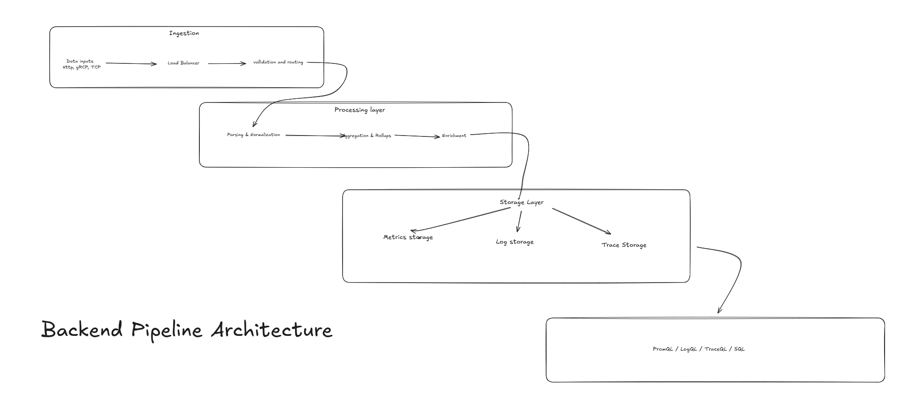

---

## 4. Intelligence Layer\*\*

### A. Insights

Insights are meaningful findings we get from raw observability data.
They help us understand what changed, what is trending, and what needs attention.

### What are “insights” in observability?

Insights are the final output that tells us something important.
They convert raw numbers, logs, and traces into clear statements like:

- “API latency increased 50% in the last hour”
- “Error rate spiked for service X”
- “Database CPU is trending upward for the last 3 days”

### How are insights generated from raw data?

The system looks at large amounts of metrics, logs, and traces and applies different techniques to find patterns.

---

### Pattern Recognition Techniques

#### **1. Statistical Analysis**

Used to understand the common behavior of the system.

- **Mean** – average
- **Median** – the middle value
- **Percentiles** – like p95 and p99 latency
- **Standard Deviation** – how much values fluctuate

#### **2. Trend Analysis**

Checks if something is going up, down, or staying stable.

#### **3. Correlation Analysis**

Finds which metrics or logs move together.

Example:
When **latency increases**, maybe **error rate** also increases.

### **Machine Learning Approaches**

Sometimes simple rules are not enough, so ML models detect deeper patterns.

#### **1. Clustering**

Groups similar patterns or behaviors together.
Like grouping services with similar traffic patterns.

#### **2. Forecasting**

Predicting what will happen based on past trends.
Example: predicting CPU usage for next 3 hours.

#### **3. Classification**

Models that tag events into categories.
Example: labeling incidents as “timeout issue”, “DB issue”, “network issue”.

- API latency increased 50% in last hour
- Error rate suddenly spiked for service X
- Disk usage will reach 90% in 3 days
- Traffic dropped after last deployment
- p99 latency is higher in EU region compared to US region

## **B. Anomalies**

An anomaly is something that behaves differently from the normal pattern.
In observability, an anomaly means the system is acting in an unexpected way.

### **What is an anomaly in observability context?**

It is any sudden change or unusual pattern that does not match normal behavior.

- Sudden spike in latency
- Error rate jumping from 1% to 20%
- CPU going from 40% to 95% in few seconds

### **Anomaly Detection Methods**

Different techniques are used to identify abnormal behaviors.

### **1. Threshold-based**

#### **Static Thresholds**

Fixed limits.
Example: alert when CPU > 85%.

#### **Dynamic Thresholds**

Limits change automatically based on past data.
Example: latency > (normal + margin).

#### **2. Statistical Methods**

These use math to decide what is “normal”.

- **Z-score** – how far a value is from the average
- **IQR** – detects values outside the normal range
- **Moving Averages** – sees if the current value is far away from the recent trend

#### **3. Machine Learning Methods**

Used when patterns are complex.

- **Isolation Forests** – isolate strange data points
- **Autoencoders** – learn normal patterns and detect unusual ones
- **LSTM (Recurrent Networks)** – used for time-based predictions and anomalies

#### **Handling Seasonality and Trends**

Systems behave differently during peak hours, weekends, or deployments.
Anomaly detection must understand these natural patterns.

#### **False Positive Reduction**

If the system alerts too often, engineers stop trusting alerts.
To reduce false positives:

- Combine multiple signals
- Ignore short spikes
- Apply smoothing
- Use contextual data (deployments, maintenance)

---

#### **Severity Classification**

Not all anomalies are equal.
We classify them based on impact:

- **Low** – minor spikes
- **Medium** – noticeable but safe
- **High** – likely impact on customers
- **Critical** – system failure

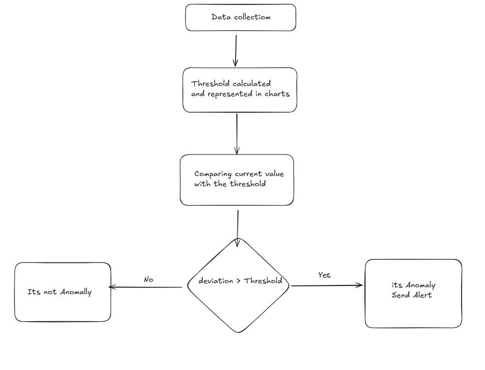

### **C. Root Cause Analysis (RCA)**

**1. What is RCA? Why is it difficult in distributed systems?**
Root Cause Analysis (RCA) in observability is the process of identifying the underlying factor that triggered an incident. In modern distributed architectures—microservices, service meshes, event-driven systems—RCA is challenging because:

- Failure modes propagate across multiple services and layers (compute, network, storage, external dependencies).
- Symptoms often appear far away from the actual cause.
- High cardinality data (labels, tags, metadata) increases search complexity.
- Asynchronous communication, retries, and dynamic scaling hide causal chains.

---

**2. RCA Techniques**

**A. Correlation analysis across metrics**
Determine which metrics changed together in the same timeframe to narrow down potential causality.

- Compare latency, error rate, throughput, saturation, resource utilization.
- Identify “first metric to change,” not just the metrics that changed eventually.
- Detect upstream/downstream correlation using time-aligned windows.

**B. Dependency mapping (service mesh, call graphs)**
Use service dependency graphs to determine which upstream component is likely generating the downstream symptom.

- Outbound and inbound dependency analysis.
- Dynamic topology through service discovery.
- Identify choke points (e.g., a failing shared cache, database, or API gateway).

**C. Trace analysis for bottlenecks**
Distributed tracing helps identify where latency or errors originate.

- Critical path identification.
- Slow spans or high error spans.
- Span-level metadata analysis (tags, events, errors).
- Compare “normal traces” vs “slow traces” to isolate anomalies.

**D. Log aggregation and pattern matching**
Use logs to confirm or reject hypotheses formed from metrics and traces.

- Error pattern clustering (e.g., stack trace grouping).
- Log frequency analysis around incident windows.
- Structured logs to identify failing code paths, request IDs, or exception types.

**E. Change event correlation**
Incidents frequently correlate with change events.

- Deployment timestamps.
- Configuration updates.
- Infrastructure scaling events.
- Feature flag toggles.
  Aligning incident timeline with change timeline often identifies root causes quickly.

**3. How Observability Platforms Support RCA**
Modern observability systems streamline RCA by:

- Providing unified metric-log-trace correlation.
- Enabling dependency graph visualization.
- Automatically highlighting anomalous time windows.
- Offering comparison tooling (baseline vs incident).
- Surfacing probable root causes using machine learning–based correlation engines.
- Tagging data with workload metadata (service, version, region, pod, deployment).

**4. Example RCA Workflow**
**Scenario:** High latency alert triggered.

1. **Identify affected service**
   Confirm which service triggered the alert and review key metrics (latency, throughput, errors).

2. **Inspect dependency impact**
   Determine whether upstream or downstream dependencies show correlated changes.

3. **Analyze slow traces**
   Pull representative slow traces and inspect the critical path to find the slowest spans.

4. **Break down problematic spans**
   Examine span attributes: SQL timings, external API latency, lock contention, queue delays.

5. **Correlate with logs**
   Search log events for exceptions, timeouts, or retried requests matching trace IDs.

6. **Check change events**
   Compare the incident start time with deployment logs or config updates.

7. **Determine root cause**
   E.g., a new deployment introduced a slow database query, causing cascading latency.

## 5. Observability User Experience

### **A. Dashboard Patterns (Simple + Unpolished)**

Dashboards are the screens where we see what is happening in our system.
They take metrics, logs, traces and show them in charts so we can quickly understand if things are normal or broken.

### **Common Visualization Types**

#### **1. Time-series graphs**

These show how a value changes over time.

- Line graph
- Area graph
- Stacked graph
  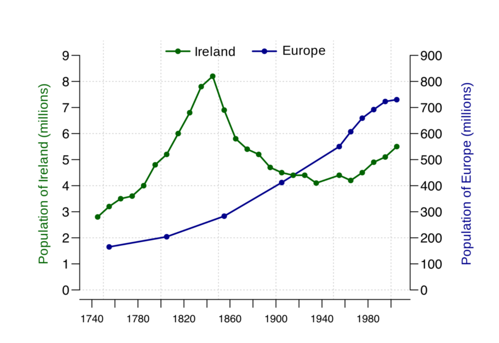
  

**Ex:** CPU going up and down, latency increasing, error rate suddenly spiking.

**Simple analogy:**
Like the heart rate graph in hospitals that keeps moving.

#### **2. Gauges / Single-Stat Panels**

Shows one important number right now.

- CPU now
- Error rate now
- Memory now

Speedometer in a bike. Just one number.

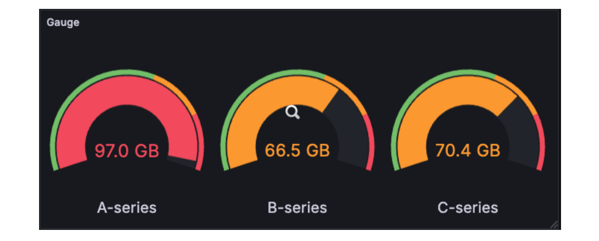

#### **3. Heatmaps**

Shows slow and fast requests as color blocks.
Useful for seeing latency patterns.

Like a weather heatmap showing hot and cold areas.

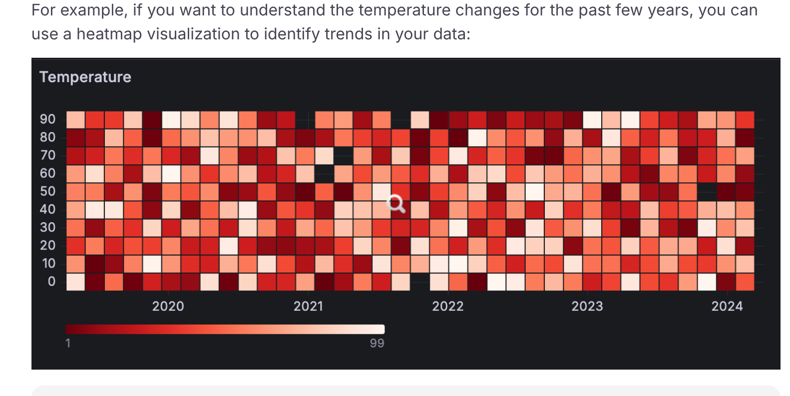

#### **4. Histograms**

Shows how many requests fall in each latency bucket.

**Ex:**
0–50ms, 50–100ms, 100–200ms.

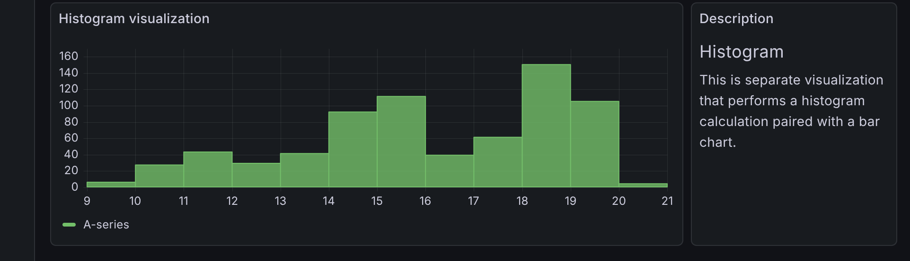

#### **5. Tables / Logs Panel**

Shows exact values or logs.
Useful when debugging specific issues.

### **Dashboard Organization**

Dashboards are usually split into groups based on what we want to monitor.

#### **1. Infrastructure Dashboards**

These show machine-level metrics:

- CPU
- Memory
- Disk
- Network
- Node restarts

Used to check Is the server healthy?


#### **2. Application Dashboards**

Shows how the app is behaving:

- Requests
- Errors
- Latency (p95, p99)
- DB calls
- Cache hits

Focus: RED metrics (Rate, Errors, Duration).

#### **3. Business KPI Dashboards**

Shows business-level metrics:

- Signups
- Orders
- Checkout success
- Revenue
  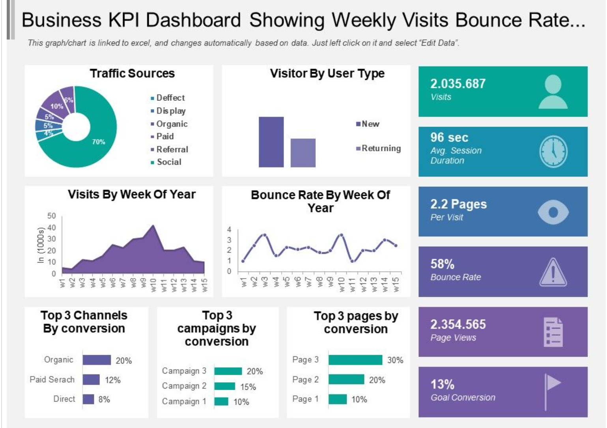

### **Variables and Templating**

Dashboards give filters so you can switch between:

- environments (dev/stage/prod)
- services
- regions
- hosts

Same dashboard works for multiple use cases.

### **Information Density**

How much information to show?

- Too much → confusing
- Too little → you miss problems

Aim is to show the most important things on top, detailed info below.

## **B. User Workflows**

### **Debugging an Incident**

This is the common flow almost every engineer follows when something breaks.

#### **1. Alert triggers**

Incident starts with an alert from the monitoring system.
Example: “High latency on checkout-service”.

#### **2. User opens dashboard**

Engineer goes to the main dashboard of that service or system.

#### **3. Identify time range and affected components**

First step is to set the correct time range (last 15m, 1h, 6h).
Then check which service, region, or host shows abnormal values.

#### **4. Drill down into the specific service/host**

Once the problem area is known, they click into more detailed panels.
Example: checkout-service → pod → specific instance.

#### **5. Correlate metrics**

Look at graphs:

- Is latency high?
- Are errors increasing?
- CPU/memory spiked?
- DB calls taking longer?

See which metric changed first.

#### **6. Check logs for errors**

Now the engineer opens logs:

- Look for exceptions
- Look for timeouts
- Look for retry loops
- Search by traceID or userID

Logs confirm what metrics hinted.

#### **7. Find traces for slow requests**

Open distributed tracing:

- Check slow spans
- Look at DB calls
- Look at external API calls
- Find critical path

Traces show exactly _where_ the delay happened.

#### **8. Identify root cause**

By now, metrics + logs + traces point to the real issue.
Example: slow DB query, failed dependency, new deployment, memory leak.

#### **9. Verify fix**

After making the fix, user checks dashboards again.
Latency goes back to normal → incident resolved.

### **How Users Navigate Between Metrics, Logs, and Traces**

Users usually follow this pattern:

1. Start from **metrics** (first signal something is wrong).
2. Jump to **logs** to see what errors happened at that exact time.
3. Jump to **traces** to see where exactly the request slowed down.

This triangle flow (metrics → logs → traces) is the standard workflow.

### **Time Range Selection and Time Sync**

When debugging, time sync is critical:

- User picks a time range (example: last 15 minutes).
- Metrics, logs, and traces all sync to the same time window automatically.
- This ensures the user sees all data from the same incident moment.

Without time-sync, debugging becomes impossible.

### **Search and Filtering Patterns**

Users commonly filter by:

- service name
- pod name / host name
- traceID / requestID
- error keyword (“timeout”, “500”, “connection refused”)
- region / cluster
- userID (in logs)

Filters help reduce noise and only show relevant data.

### **Drill-down: Summary → Detail**

Dashboards follow top-to-bottom flow:

1. **Summary panels**
   High-level overview: requests, errors, latency.

2. **Service-level detail**
   Per-service or per-endpoint metrics.

3. **Resource-level detail**
   Pod-level, node-level, DB-level, cache-level metrics.

4. **Logs and traces**
   Final step where you see exact reason.

## **C. Tool Analysis**

Here we see how real observability tools behave in UI and UX.
Examples: **Grafana**, **New Relic**.

#### **1. What makes a dashboard intuitive?**

A dashboard feels easy when:

- It shows the most important metrics on top
- No need to click too much to find issues
- Clear colors: red for bad, green for good
- Time range selection is very easy
- Panels update together when time changes
- Navigation between metrics → logs → traces is simple

If user can find the issue in less than 1–2 minutes = good dashboard.

#### **2. Handling large datasets**

These tools deal with massive data. They use:

- **Pagination**
  Show results page by page (especially logs)

- **Virtual scrolling**
  Only load what user sees on screen at that moment

- **Aggregation**
  Instead of showing every data point, show summary values
  Example: avg latency per minute instead of all requests

All these reduce browser load and backend cost.

#### **3. Real-time updates vs Static Snapshots**

- **Real-time dashboards**
  Auto-refresh every few seconds
  Useful for live outages

- **Static view**
  Used for looking back in time
  Example: yesterday night incident

User switches between both depending on situation.

#### **4. Insights / Anomalies / Alerts Presentation**

Tools highlight problems like:

- Red colored boxes
- Cards saying “Latency increased 50%”
- Anomaly markers on graphs
  Example: triangles/flags on high latency spots
- Alerts shown at top of screen or side panel

Important things should catch user attention instantly.

#### **5. What UX patterns work well?**

Good:

- Clicking on a metric jumps to logs of same time
- Trace links from logs
- Group charts in “Overview at top → details below”
- Highlight only the panels with problems (not the whole dashboard)

Confusing:

- Too many metrics in one place
- Too many colors
- Hidden filters
- Nested dashboards where you get lost clicking around

Good UX = fewer clicks + faster understanding.

## **D. Insight Presentation**

Insights tell user what is wrong without them digging deep.

### **1. How Insights Are Shown**

Common UI styles:

- **Cards** with short messages
  “Error rate spike in checkout service”
- **Popup notifications** in the dashboard
- **Side panels** with suggestions
- **Dedicated “Insights” pages** that list all active issues

User should not search for insights; tool must show loudly.

### **2. Anomaly Visualization Techniques**

Tools mark anomalies directly on graphs:

- Dots or flags on high error points
- Shaded area on strange behavior zone
- Color change (green → yellow → red)
- Timeline markers

User can click anomaly point → open logs/traces around that time.

### **3. RCA (Root Cause) Guided UI**

Tools help find root cause step-by-step:

- Show related metrics that also changed
- Highlight dependency graph, failures in upstream/downstream
- Auto-detect slow spans in traces
- Group logs by error pattern
- Show “Recently deployed version: may be the cause”

Tool tries to guide user like a checklist.

### **4. Alert Management UX**

Alerts are shown with:

- Severity (critical, warning)
- Which service impacted
- What metric crossed threshold
- When alert started
- Link to dashboard/traces for debugging

Good UX features:

- Snooze alerts to avoid noise
- Group alerts by incident
- Tag alerts by team and environment
- Show history who acknowledged it

### D. Insight Presentation

- Tools should show the important info directly.
- User should not dig too much to find problems.

1. How insights show on screen

   - They show small cards saying “this looks bad”
   - They give notifications when something goes wrong
   - Some tools have separate page only to show insights
   - Main idea: user sees problem fast

2. How weird behavior (anomaly) shown

   - Sudden spikes in graph get red color or warning mark
   - Compare before and after to show change clearly
   - Sometimes text on the graph: “this point is not normal”
   - Helps user understand what changed suddenly

3. RCA (Root Cause) help

   - Tools guide user step-by-step to find main issue
   - Show which services connected to each other
   - Highlight slow service or broken part in call flow
   - Show logs exactly from the problem time
   - Show if any deployment/config changed at same time
   - So users don’t guess blindly

4. Alert handling (Alert UX)
   - Alerts list with severity (critical, warning)
   - User can assign alert to self or teammate
   - Same type alerts grouped so less noise
   - Alert directly links to logs, dashboard, traces
   - Can silence alert if not needed now

Here you go. Layman style. Unpolished. Same flow like your earlier notes.

## **6. Technical Challenges & Trade-offs**

- In observability, data is huge.
- Everything costs money.
- Any decision has good and bad side.

#### **A. Data Volume & Cost**

- Big apps produce tons of metrics, logs, traces every second
- Storing all is very expensive
- Sending too much data eats network
- So teams must choose what to save and what to drop

#### **B. Cardinality Explosion**

- When label values are too many (like userID, sessionID)
- Storage will blow up
- Queries become super slow
- Solution: remove useless labels, group data smartly

#### **C. Sampling Trade-offs**

- We cannot keep every trace
- So we sample (keep only some traces) to save cost
- But we may lose rare important errors
- Two types:
  - Head-based: decide at start of trace
  - Tail-based: decide at end after seeing if it’s interesting

#### **D. Real-time vs Batch**

- Real-time: alerts fast but expensive
- Batch: cheaper but delayed
- Mix both depending on what is important

#### **E. Storage Optimization**

- Compression: less space but slower to query
- Downsample old data: keep less detail for old time
- Retention: after some days, delete old data

#### **F. Query Performance**

- Data is huge, but user wants fast results
- Use indexes to make search faster
- Pre-aggregation: do work earlier → faster queries but more space
- On-demand aggregation: do work during query → slower but less space

#### **G. Alert Fatigue**

- Too many alerts → nobody cares anymore
- Need smart alerts, reduce noise
- Group related alerts
- Only alert for real user impact

#### **H. Context Correlation**

- Hard to link metric problem to exact log line or trace span
- Need same IDs across whole system (trace ID, service name)
- Tools try to connect them but not always perfect
